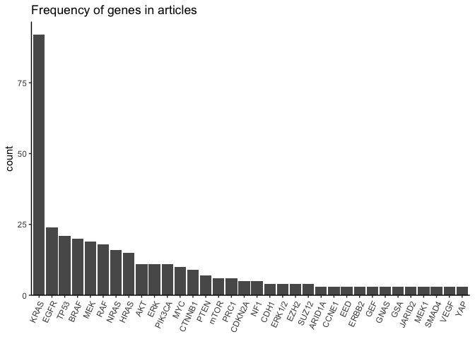
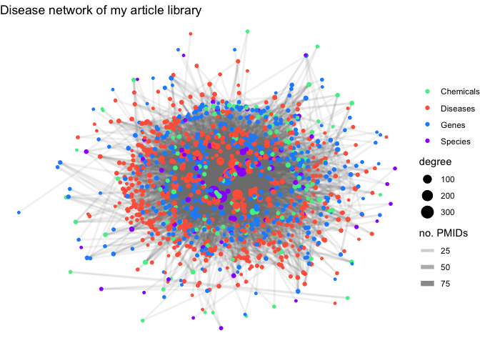
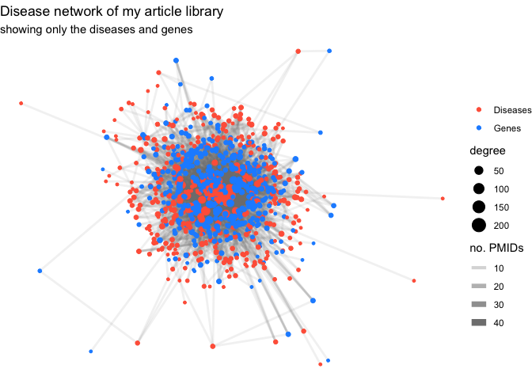

NLP Analysis of My Scientific Jounral Library
================
Joshua Cook
May 4, 2019

In this analysis, I use ‘Pubtator’ to analysis my own biomedical article
library.

## Data

I began by exporting the data for all of my journal articles in Mendeley
as a ‘.bib’ file format. This is available in
“data/mendeley\_library.bib”. The
[‘bibtex’](https://cran.r-project.org/web/packages/bibtex/index.html)
package was used to read in the file as a `bibentry` object.

``` r
bib <- bibtex::read.bib("data/mendeley_library.bib")
class(bib)
```

    #> [1] "bibentry"

After ‘bibtex’ automatically ignores incomplete references, there were
780 entries. I took a look at the first few entries to get an idea of
what I was dealing with.

    #> Zou J, Lei T, Guo P, Yu J, Xu Q, Luo Y, Ke R, Huang D (2019).
    #> "Mechanisms shaping the role of ERK1/2 in cellular senescence
    #> (Review)." _Molecular medicine reports_, *19*(2), 759-770. ISSN
    #> 1791-3004, doi: 10.3892/mmr.2018.9712 (URL:
    #> http://doi.org/10.3892/mmr.2018.9712), <URL:
    #> http://www.ncbi.nlm.nih.gov/pubmed/30535440
    #> http://www.pubmedcentral.nih.gov/articlerender.fcgi?artid=PMC6323238>.
    #> 
    #> Tosi D, Pérez-Gracia E, Atis S, Vié N, Combès E, Gabanou M,
    #> Larbouret C, Jarlier M, Mollevi C, Torro A, Del Rio M, Martineau
    #> P, Gongora C (2018). "Rational development of synergistic
    #> combinations of chemotherapy and molecular targeted agents for
    #> colorectal cancer treatment." _BMC cancer_, *18*(1), 812. ISSN
    #> 1471-2407, doi: 10.1186/s12885-018-4712-z (URL:
    #> http://doi.org/10.1186/s12885-018-4712-z), <URL:
    #> https://doi.org/10.1186/s12885-018-4712-z
    #> http://www.ncbi.nlm.nih.gov/pubmed/30103709
    #> http://www.pubmedcentral.nih.gov/articlerender.fcgi?artid=PMC6090616>.

The data was turned into a tibble for easier use.

``` r
bib <- RefManageR::as.BibEntry(bib) %>%
    as.data.frame() %>% 
    as_tibble()
```

The data was now in a more managable format for data analysis.

    #> # A tibble: 780 x 28
    #>    bibtype abstract author doi   file  issn  journal keywords month number
    #>    <chr>   <chr>    <chr>  <chr> <chr> <chr> <chr>   <chr>    <chr> <chr> 
    #>  1 Article Senesce… Junro… 10.3… ":Us… 1791… Molecu… Dual ro… feb   2     
    #>  2 Article BACKGRO… Diego… 10.1… :Use… 1471… BMC ca… Colorec… aug   1     
    #>  3 Article The acq… Annet… 10.1… :Use… 1937… Scienc… <NA>     mar   166   
    #>  4 Article Kinase … James… 10.1… :Use… 1097… Cell    <NA>     apr   2     
    #>  5 Article The RAS… Susan… 10.1… :Use… 1538… Cancer… <NA>     may   10    
    #>  6 Article Activat… Chris… 10.1… :Use… 1465… Nature… <NA>     may   5     
    #>  7 Article "Lung c… Guill… 10.1… :Use… 1932… PloS o… <NA>     <NA>  1     
    #>  8 Article Mutatio… Alyss… 10.1… :Use… 1097… Molecu… proj:co… apr   1     
    #>  9 Article "BACKGR… Chris… 10.1… :Use… 1474… The La… <NA>     oct   13    
    #> 10 Article <NA>     Asher… 10.1… :Use… 1474… Nature… <NA>     oct   10    
    #> # … with 770 more rows, and 18 more variables: pages <chr>, pmid <chr>,
    #> #   title <chr>, url <chr>, volume <chr>, year <chr>, annote <chr>,
    #> #   isbn <chr>, `mendeley-tags` <chr>, publisher <chr>,
    #> #   archiveprefix <chr>, arxivid <chr>, eprint <chr>, booktitle <chr>,
    #> #   address <chr>, editor <chr>, primaryclass <chr>, urldate <chr>

## Accessing Pubtator

I used the
[’pubmed.mineR](https://cran.r-project.org/web/packages/pubmed.mineR/index.html)
package (here is a link to the original publication [Rani *et al.*,
(2015)](https://www.ncbi.nlm.nih.gov/pubmed/26564970)) to pull
information on the pubications from Pubtator.

The information can be gathered for a publication using
`pubtator_function(pmid)`.

``` r
# turns the pubtator results into a tidy tibble, indexed by PMID
pubtator_to_tibble <- function(pubtato) {
    pubtato <- unlist(pubtato)
    if (!"PMID" %in% names(pubtato)) return(NULL)
    pmid <- pubtato[["PMID"]]  # extract the PMID
    # create a tibble with a row for each field and value, indexed by PMID
    tib <- tibble(PMID = pmid,
                  field = names(pubtato),
                  val = pubtato) %>% 
        filter(field != "PMID") %>%  # remove PMID
        mutate(field = str_remove_all(field, "[:digit:]+"))
    return(tib)
}


pubtatoes <- purrr::map(bib$pmid, pubmed.mineR::pubtator_function) %>% 
    purrr::map(pubtator_to_tibble) %>% 
    bind_rows()
```

    #> # A tibble: 3,713 x 3
    #>    PMID     field     val              
    #>    <chr>    <chr>     <chr>            
    #>  1 30535440 Genes     ERK1/2           
    #>  2 30535440 Diseases  cancer           
    #>  3 30103709 Genes     AKT              
    #>  4 30103709 Genes     MEK1             
    #>  5 30103709 Genes     MEK              
    #>  6 30103709 Genes     ERK              
    #>  7 30103709 Diseases  colorectal cancer
    #>  8 30103709 Diseases  CRC              
    #>  9 30103709 Diseases  tumour           
    #> 10 30103709 Chemicals irinotecan       
    #> # … with 3,703 more rows

There were a few cleaning steps needed. These were completed in the
following pipeline - I tried to add comments wherever I could.

``` r
replace_synonyms <- function(x) purrr::map_chr(x, replace_synonym)
replace_synonym <- function(x) {
    if (x %in% c("epidermal growth factor receptor",
                 "Epidermal growth factor receptor")) {
        return("EGFR")
    } else if (x == "beta-catenin") {
        return("CTNNB1")
    } else if (x %in% c("K-ras", "K-Ras", "Kras", "KRas")) {
        return("KRAS")
    } else if (x %in% c("N-ras", "N-Ras", "Nras", "NRas")) {
        return("NRAS")
    } else if (x %in% c("H-ras", "H-Ras", "Hras", "HRas")) {
        return("HRAS")
    } else if (x %in% c("p53")) {
        return("TP53")
    } else if (x %in% c("Akt")) {
        return("AKT")
    } else if (x %in% c("Raf")) {
        return("RAF")
    } else if (x == "E-cadherin") {
        return("CDH1")
    }
    return(x)
}

pubtatoes %<>% 
    mutate(val = str_remove_all(val, "\\(|\\)")) %>%  # remove parantheses
    mutate(val = replace_synonyms(val)) %>%
    unique()
```

## Simple Analysis

### Which genes do I read about most frequently?

Since I study the genetics of *KRAS*, I expect there to be a lot of
papers about its interactors and other oncogenes in *RAS*-driven cancers
(such as *APC* in CRC and *STK11* in NSCLC).

``` r
pubtatoes %>% 
    filter(field == "Genes") %>%
    mutate(val = forcats::fct_lump_min(val, min = 3)) %>%
    filter(val != "Other") %>%
    mutate(val = forcats::fct_infreq(val)) %>%
    ggplot() +
    geom_bar(aes(x = val)) +
    theme_classic() +
    scale_y_continuous(expand = expand_scale(mult = c(0, 0.05))) +
    theme(axis.text.x = element_text(angle = 65, hjust = 1),
          axis.title.x = element_blank()) +
    labs(y = "count",
         title = "Frequency of genes in articles")
```

<!-- -->

As expected, there are a lot of genes in the MAPK pathway,
PI3Kalpha-Akt, oncogenes, and tumor supressors. Funny enough, a small
project that I am working on concerning Polycomb repressive complex 2
(PRC2) has made quite the impact as several of the subunits are in the
list, including *JARID2*, *EZH2*, and *SUZ12*. Interestingly, though,
PRC1 is on the list, but the term PRC2, is not. I wonder if this is just
due to the differences in how people discuss the two related complexes
in papers.

`#> TODO: more simple plots to explore the data further`

## Disease Network

For the files with at least one disease and other entity (gene,
chemical, etc.), I drew a link between them to create a disease network
for my library. I used the
[‘tidygraph’](https://cran.r-project.org/web/packages/tidygraph/index.html)
package for handling the graph.

``` r
# remove the NULL values of a list
remove_nulls <- function(x) {
    idx <- purrr::map_lgl(x, is.null)
    return(x[!idx])
}

# make a graph for an individual file
file_disease_gene_graph <- function(PMID, data) {
    # get disases and genes for the file
    diseases <- data %>% filter(field == "Diseases") %>% u_pull(val) %>% unlist()
    genes <- data %>% filter(field != "Diseases") %>% u_pull(val) %>% unlist()
    
    # check there are both dieases and genes
    if (length(diseases) < 1 | length(genes) < 1) {
        return(NULL)
    }
    
    # construct the graph
    gr <- expand.grid(diseases, genes) %>% 
        as_tibble() %>%
        mutate(pmid = !!PMID) %>%
        as_tbl_graph(directed = TRUE)
    return(gr)
}

pub_gr <- pubtatoes %>% 
    group_by(PMID) %>% 
    tidyr::nest() %>%
    pmap(file_disease_gene_graph) %>% 
    remove_nulls() %>% 
    recursive_graph_join()
```

    #> # A tbl_graph: 1291 nodes and 6650 edges
    #> #
    #> # A directed multigraph with 13 components
    #> #
    #> # Node Data: 1,291 x 1 (active)
    #>   name             
    #>   <chr>            
    #> 1 cancer           
    #> 2 ERK1/2           
    #> 3 colorectal cancer
    #> 4 CRC              
    #> 5 tumour           
    #> 6 AKT              
    #> # … with 1,285 more rows
    #> #
    #> # Edge Data: 6,650 x 3
    #>    from    to pmid    
    #>   <int> <int> <chr>   
    #> 1     1     2 30535440
    #> 2     3     6 30103709
    #> 3     4     6 30103709
    #> # … with 6,647 more rows

I then annotated the nodes as either a disease or gene.

``` r
tt <- pubtatoes %>% select(field, val) %>% unique()
names(tt) <- c("type", "name")
pub_gr <- pub_gr %N>%
    left_join(tt, by = "name")
```

    #> Error in `vertex.attributes<-`(graph, index = index, value = value): Invalid attribute value length, must match number of vertices

This resulted in an error. Normally, I would fix this and no one would
see the error, but the cause was too good not to share…

I have used ‘tidygraph’ long enough to know that this error is thrown
when merging with nodes when there are some nodes being mapped to
multiple rows in the joining data table (`tt` in this case). Therefore,
I isolated the values in `tt$name` with more than one entry.

``` r
tt %>%
    mutate(name = fct_lump_min(name, min=2)) %>%  # lump values with <2 entries
    filter(name != "Other") %>%  # filter out the renamed values
    arrange(name)  # arrange by `name` column
```

    #> # A tibble: 6 x 2
    #>   type      name      
    #>   <chr>     <fct>     
    #> 1 Diseases  APC       
    #> 2 Genes     APC       
    #> 3 Diseases  Drosophila
    #> 4 Species   Drosophila
    #> 5 Diseases  IPMN      
    #> 6 Chemicals IPMN

This means that Pubtator listed *APC* both as a disease and a gene. This
is realy not a bad prediction considering that this gene oringially
recieved its name from the disease it was first discovered while
studying: Adenomatous polyposis coli. However, the others are less
forgivable. *Drosophila* is not a gene, it is a fruit fly,therefore,
`"Species"` was the correct designation. IPMN stands for “intraductal
papillary mucinous neoplasm” which is a benign tumor that can progress
to pancreatic cancer (more information can be found at the [American
Cancer Society’s
website](https://www.cancer.org/cancer/pancreatic-cancer/about/what-is-pancreatic-cancer.html)).

Finally, I manually removed the erroneous entries and made the join to
complete the disease network.

``` r
tt %<>%
    filter(!(type == "Diseases" & name == "APC")) %>% 
    filter(!(type == "Diseases" & name == "Drosophila"))%>%
    filter(!(type == "Chemicals" & name == "IPMN"))
pub_gr <- pub_gr %N>%
    left_join(tt, by = "name")
```

    #> # A tbl_graph: 1291 nodes and 6650 edges
    #> #
    #> # A bipartite multigraph with 13 components
    #> #
    #> # Node Data: 1,291 x 2 (active)
    #>   name              type    
    #>   <chr>             <chr>   
    #> 1 cancer            Diseases
    #> 2 ERK1/2            Genes   
    #> 3 colorectal cancer Diseases
    #> 4 CRC               Diseases
    #> 5 tumour            Diseases
    #> 6 AKT               Genes   
    #> # … with 1,285 more rows
    #> #
    #> # Edge Data: 6,650 x 3
    #>    from    to pmid    
    #>   <int> <int> <chr>   
    #> 1     1     2 30535440
    #> 2     3     6 30103709
    #> 3     4     6 30103709
    #> # … with 6,647 more rows

To begin visualizing the network, I plotted the largest component (which
was almost all of the nodes). The nodes were colored by their type, and
their size was associated with how many connections they made. The edge
width and transparency was associated with the number of articles
(PMIDs) that made the link.

<!-- -->

A few things stood out to me. First, the network is incredibly dense.
This is likely caused by the largse number of disease being highly
redundant (ie. “colorectal cancer”, “COAD”, “CRC”). These would likely
share a lot of the other entities, pulling the network tighter.

Also, there are *way* more species than I would have predicted. **These
warrant further investigation**.

Considering only the diseases and genes

<!-- -->
